# Trabajo Práctico 3

Miembros: Josu Barrutia y Unax Murua

1. [Kafka + Druid + Superset](#Kafka + Druid + Superset)

## Kafka + Druid + Superset

Lo primera que vamos a hacer es crear un script en Python [visualize.py](./visualize.py) que nos permita, usando pyarrow, obtener el esquema del fichero Flights.parquet y entender su contenido.
```bash
$ ./visualize.py
Esquema del archivo Parquet:
FL_DATE: date32[day]
DEP_DELAY: int16
ARR_DELAY: int16
AIR_TIME: int16
DISTANCE: int16
DEP_TIME: float
ARR_TIME: float

Primeras filas del contenido del archivo Parquet:
      FL_DATE  DEP_DELAY  ARR_DELAY  AIR_TIME  DISTANCE   DEP_TIME   ARR_TIME
0  2006-01-01          5         19       350      2475   9.083333  12.483334
1  2006-01-02        167        216       343      2475  11.783334  15.766666
2  2006-01-03         -7         -2       344      2475   8.883333  12.133333
3  2006-01-04         -5        -13       331      2475   8.916667  11.950000
4  2006-01-05         -3        -17       321      2475   8.950000  11.883333
```

Transformamos el fichero Flights.parquet a un fichero Flights.json con el script [parq2json.py](./parq2json.py)

Se ha creado un fichero compose único [docker-compose.yaml](./docker-compose.yaml) que define un clúster Kafka (bitnami/kafka y bitnami/zookeeper), un productor que genera eventos de topic "My_Topic" extraídos de Flights.json, un servidor Druid y un servidor Superset, todos ellos conectados a una red llamada kafka-net. El productor se construye a partir del fichero [Dockerfile](./Dockerfile), el cual instala las librerías necesarias para ejecutar el script [event_generator.py](./event_generator.py) que envía eventos al topic "My_Topic", utilizando la información del fichero [config.yaml](./config.yaml) para conectarse al servidor Kafka.

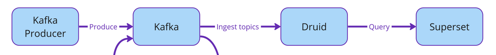


Una vez lanzados los servicios `docker compose up -d`, nos conectamos al contenedor productor y ejecutamos el script [event_generator.py](./event_generator.py) para enviar mensajes al topic flights.
```bash
docker exec -it ipmd-practica3-kafka-python-productor-1 /bin/bash
root@62475ba7b318:/kafka_python# python event_generator.py
```

En este momento, el productor está enviando eventos al topic "My_Topic". Para que estos eventos sean ingeridos por el servidor Druid, nos conectamos al webUI de Druid en http://localhost:9999 y cargamos datos desde kafka:

Seleccionamos la opción "Kafka" y rellenamos los campos con la información necesaria para conectarnos al servidor Kafka y al topic "My_Topic":

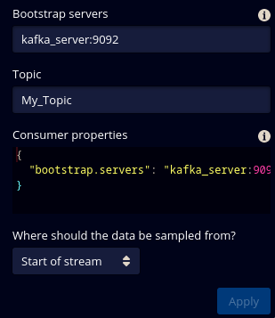

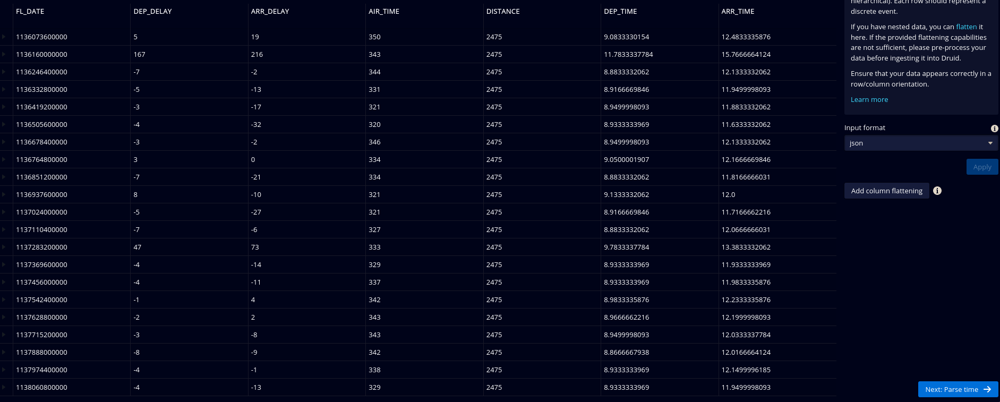

Vamos a indexar por la columna "FL_DATE" con formato "millis" y 

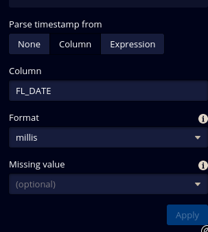

Seleccionamos "Use early offset" y "Status Pending" para que los eventos sean indexados en cuanto lleguen al servidor Druid:

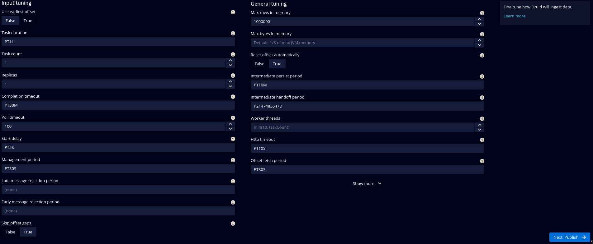

Podemos ver como el status al principio es "Pending", pero a continuación cambia a "Running":

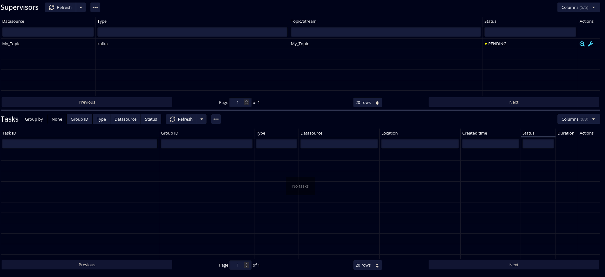

Una vez cargados los datos, podemos consultarlos en la pestaña "Query" de la tabla "My_Topic" en el datasource "My_Topic", podemos ver como el número de eventos va aumentando:

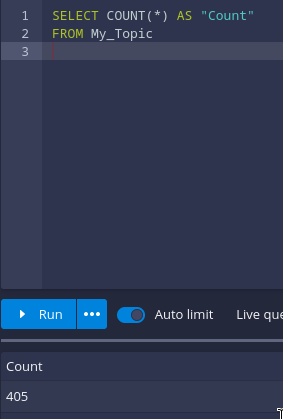
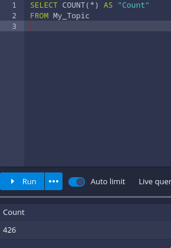


Para visualizar los datos en Superset, nos conectamos al webUI de Superset en http://localhost:8088 y creamos un nuevo datasource de tipo "Druid":

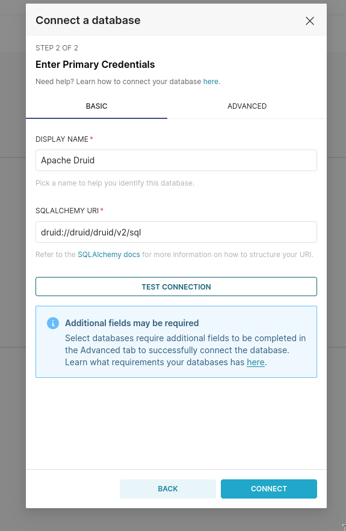

Ahora podemos crear un nuevo dashboard y añadir un gráfico de tipo "Time Series" con los datos de nuestro datasource, tendremos que usar _time como campo temporal y ARR_DELAY como métrica, calculando la media y maximo:

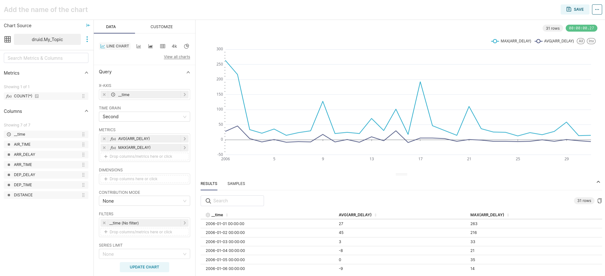

Si refrescamos se pueden ver los cambios en tiempo real.

 [Kafka + Druid + Superset](#Kafka + Druid + Superset)

## MQTT + Kafka + Druid + Superset

Para el paso MQTT-Kafka vamos a utilizar proxy Kafka-mqtt.

Ahora el producer pasará a ser el generador MQTT, que será el que envíe mensajes al proxy Kafka-MQTT.

Se ha creado otro fichero compose [docker-compose-mqtt.yaml](./docker-compose-mqtt.yaml) que es una modificación del original [docker-compose.yaml](./docker-compose.yaml). Esta vez, se ha sustituido el productor, kafka-python-productor, por el generador MQTT y el proxy Kafka-mqtt. El generador se construye a partir del fichero Dockerfile, el mismo que el productor en el apartado anterior, que instala las librerías necesarias para ejecutar [mqtt_generator.py](./mqtt_generator.py) y enviar mensajes al topic "My_Topic" utilizando la información del fichero config.yaml.

Lanzamos los servicios con `docker-compose -f docker-compose-mqtt.yaml up -d` y nos conectamos al generador para ejecutar [mqtt_generator.py](./mqtt_generator.py) y enviar los mensajes.

```
docker exec -it ipmd-practica3-mqtt_generator-1 /bin/bash
root@92bca9f73589:/kafka_python# python mqtt_generator.py 
```

Ahora nos conectamos a la UI de druid entrando en http://localhost:9999. Le damos a load data y seleccionamos kafka. Rellenamos los campos igual que antes: Bootstrap_Servers = kafka_server:9092 y Topic = My_Topic. 

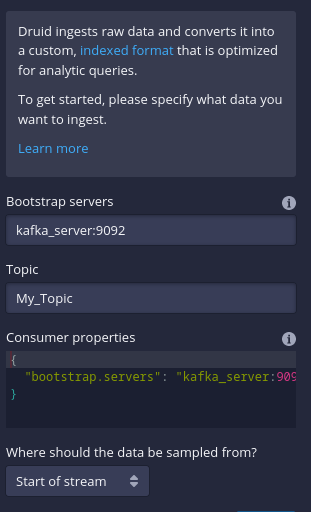

A partir de aquí es lo mismo que en la parte anterior.

Podemos ver que funcionan correctamenet las queries en Druid:

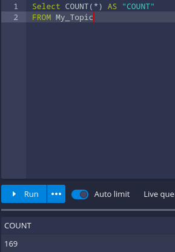


En cuanto a Superset, también funciona, conectandonos a http://localhost:8080 e introduciento el URI: `druid://druid/druid/v2/sql`. Podemos ver que funciona correctamente volviendo a mostrar el mismo gráfico que en la primera parte:

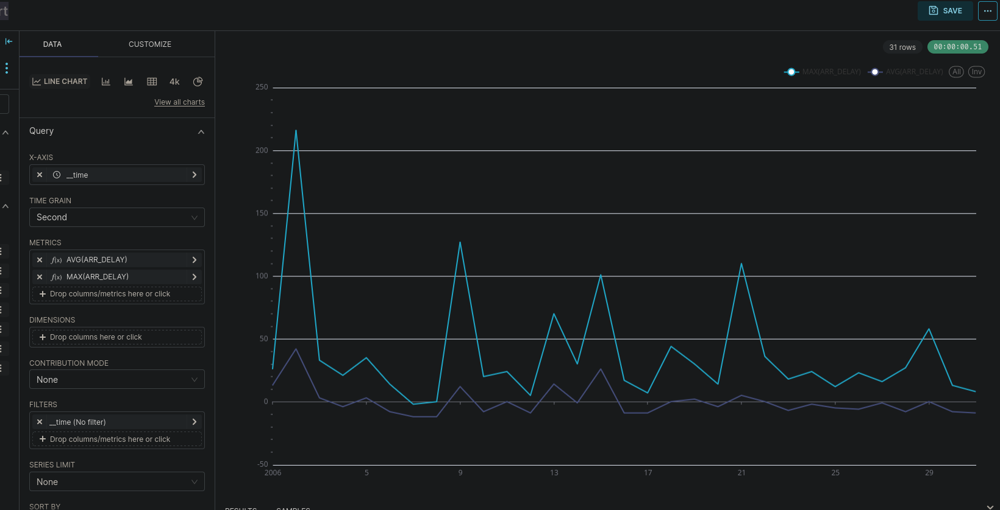